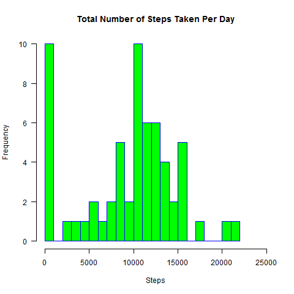
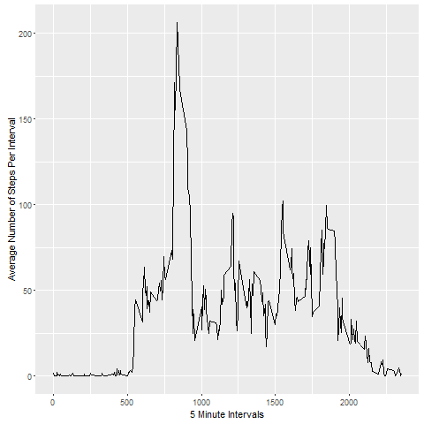
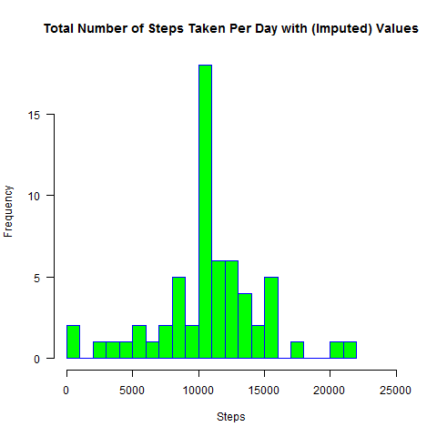
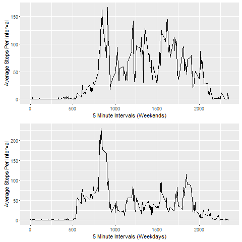

## Library Packages
```{r}
library(ggplot2)
library(grid)
```

## Loading and preprocessing the data
##### 1. Load the data (i.e. read.csv())
```{r}
zip_filename <- "repdata-data-activity.zip"
fileURL <- "https://d396qusza40orc.cloudfront.net/repdata%2Fdata%2Factivity.zip"             
csv_filename <- "activity.csv"

if (!file.exists(zip_filename)) {  
  download.file(fileURL, zip_filename) 
  if (!file.exists(csv_filename)) {  
    unzip(zip_filename) 
  }
}  

if (file.exists(zip_filename) & !file.exists(csv_filename)) {  
  unzip(zip_filename) 
}

personalActivities <- read.csv(csv_filename)
```

## What is mean total number of steps taken per day?

##### 1. Calculate the total number of steps taken per day
```{r}
sumStepsByDay <- tapply(personalActivities$steps, activityData$date, sum, na.rm=TRUE)

```

##### 2. Make a histogram of the total number of steps taken each day.
```{r}
hist(sumStepsByDay, 
     main="Total Number of Steps Taken Per Day", 
     xlab="Steps", 
     border="blue", 
     col="green",
     xlim=c(0,25000),
     las=1, 
     breaks=25)

```

##### 3. Calculate and report the mean and median number of steps taken per day.

```{r}

meanStepsByDay <- mean(sumStepsByDay)
medianStepsByDay <- median(sumStepsByDay)

```
***

* Mean number of steps per day: `r meanStepsByDay`
* Median number of steps per day:  `r medianStepsByDay`

***

## What is the average daily activity pattern?

##### 1. Make a time series plot of the 5-minute interval (x-axis) and the average number of steps taken, averaged across all days (y-axis)

```{r}
averageStepsByDayInterval <- 
  aggregate(personalActivities$steps, 
       list(interval = personalActivities$interval), mean, na.rm=TRUE)

tsChart <- ggplot(as.data.frame(averageStepsByDayInterval), 
                 aes(x=averageStepsByDayInterval$interval, 
                     y=averageStepsByDayInterval$x)) +                  
                 xlab("5 Minute Intervals") +
                 ylab("Average Number of Steps Per Interval")
tsChart + geom_line()

```


######Note: Timeseries value 500 is equivalent to 05:00 AM.  2000 = 08:00 PM.

##### 2. Which 5-minute interval, on average across all the days in the dataset, contains the maximum number of steps?

```{r}
maxSteps <- which.max(averageStepsByDayInterval$x)
timeOfMostSteps <-  averageStepsByDayInterval[maxSteps,'interval']

l <- length(timeOfMostSteps)
if (l < 4) { #example: 635
  hh <- substr(timeOfMostSteps, 1, 1)
  mm <- substr(timeOfMostSteps, 2, 3)
  time <- paste(hh, mm, sep = ':', collapse = '')
} else {    #example: 1635
  hh <- substr(timeOfMostSteps, 1, 2)
  mm <- substr(timeOfMostSteps, 3, 4)
  time <- paste(hh, mm, sep = ':', collapse = '')
}

```

* The most steps occured at: `r format(strptime(time, '%H:%M'), '%I:%M %p')`

## Imputing missing values

##### 1. Calculate and report the total number of missing values in the dataset.
```{r}
missingValuesCount <- sapply(personalActivities, function(x) sum(is.na(x)));
```

* Number of missing values: `r missingValuesCount[1]`

***


##### 2. I have chosen to create a new dataset by matching the missing values in for loop matching intervals and insert the average daily steps previously determined. 

```{r}
imputedActivities <- personalActivities 
for (i in 1:nrow(imputedActivities)) {
  if (is.na(imputedActivities$steps[i])) {
    imputedActivities$steps[i] <- averageStepsByDayInterval[
        which(imputedActivities$interval[i] == averageStepsByDayInterval$interval), ]$x
  }
}
```

##### 4. Make a histogram of the total number of steps taken each day 
```{r}
imputedSumStepsByDay <- tapply(imputedActivities$steps, imputedActivities$date, sum)
hist(imputedSumStepsByDay, 
     main="Total Number of Steps Taken Per Day with (Imputed) Values", 
     xlab="Steps", 
     border="blue", 
     col="green",
     xlim=c(0,25000),
     las=1, 
     breaks=25)
```

***

###### The distribution with imputed values appears much more normalized. 

***

##### 5. Calculate and report the mean and median total number of steps taken per day from the imputed values dataset.

```{r}

imputedMeanStepsByDay <- mean(imputedSumStepsByDay)
imputedMedianStepsByDay <- median(imputedSumStepsByDay)

```

***

* Imputed Mean number of steps per day: `r imputedMeanStepsByDay`
* Imputed Median number of steps per day:  `r imputedMeanStepsByDay`

***

##### 6. What has been the impact of imputing the missing values when compared to previous daily number of steps estimate with missing values?

```{r}
imputedMeanStepsByDay <- mean(imputedSumStepsByDay)
imputedMedianStepsByDay <- median(imputedSumStepsByDay)

percent <- function(x, digits = 2, format = "f", ...) {
  paste0(formatC(100 * x, format = format, digits = digits, ...), "%")
}

meanDifference <- percent(meanStepsByDay/imputedMeanStepsByDay)
medianDifference <- percent(medianStepsByDay/imputedMedianStepsByDay)

```
-----

* Mean   Difference Percentage with Imputed Values: `r meanDifference`
* Median Difference Percentage with Imputed Values: `r medianDifference`

-----

######It seems apparent that by filling in the missing values with the average daily steps there was a significant impact to the left side data distribution shown in the second histogram. Both the mean and median difference was quite different. Overall it appears that using the daily average to fill in the missing value for this dataset indeed is faily good method for normalizing the data. 

## Are there differences in activity patterns between weekdays and weekends?

##### Below is code to seperate the imputed dataset with two levels - "weekday" and "weekend".  The panel plot contains a time series plot of the 5-minute intervals on the (x-axis) and the average number of steps taken, averaged across all weekdays and weekends.

```{r}

#The POSIXlt data type is a vector, and the entries for day of week 
#occur in subscript 7, where the day of the week is represented by integers (0-6)
#where 0 represents Sunday)
#The POSIXlt data type is a vector, and the entries for day of week 
#occur in subscript 7, where the day of the week is represented by integers (0-6)
#where 0 represents Sunday)
weekend <- subset(imputedActivities, as.POSIXlt(imputedActivities$date)$wday == 0 | 
                                     as.POSIXlt(imputedActivities$date)$wday == 6)

avgStepsByIntForWeekend <- aggregate(weekend$steps, list(interval = weekend$interval), mean)

ts1 <- ggplot(avgStepsByIntForWeekend, 
                  aes(x=avgStepsByIntForWeekend$interval, 
                      y=avgStepsByIntForWeekend$x)) +   
  geom_line() + 
  xlab("5 Minute Intervals (Weekends)") +
  ylab("Average Steps Per Interval")

weekdays <- subset(imputedActivities, 
                   as.POSIXlt(imputedActivities$date)$wday == 1 | 
                   as.POSIXlt(imputedActivities$date)$wday == 2 |
                   as.POSIXlt(imputedActivities$date)$wday == 3 |
                   as.POSIXlt(imputedActivities$date)$wday == 4 |
                   as.POSIXlt(imputedActivities$date)$wday == 5 
                  )

avgStepsByIntForWeekdays <- aggregate(weekdays$steps, list(interval = weekdays$interval), mean)

ts2 <- ggplot(avgStepsByIntForWeekdays, 
                  aes(x=avgStepsByIntForWeekdays$interval, 
                      y=avgStepsByIntForWeekdays$x)) + 
  geom_line() + 
  xlab("5 Minute Intervals (Weekdays)") +
  ylab("Average Steps Per Interval")


# Multiple plot function
#
# ggplot objects can be passed in ..., or to plotlist (as a list of ggplot objects)
# - cols:   Number of columns in layout
# - layout: A matrix specifying the layout. If present, 'cols' is ignored.
#
# If the layout is something like matrix(c(1,2,3,3), nrow=2, byrow=TRUE),
# then plot 1 will go in the upper left, 2 will go in the upper right, and
# 3 will go all the way across the bottom.
#
multiplot <- function(..., plotlist=NULL, file, cols=1, layout=NULL) {
  require(grid)
  
  # Make a list from the ... arguments and plotlist
  plots <- c(list(...), plotlist)
  
  numPlots = length(plots)
  
  # If layout is NULL, then use 'cols' to determine layout
  if (is.null(layout)) {
    # Make the panel
    # ncol: Number of columns of plots
    # nrow: Number of rows needed, calculated from # of cols
    layout <- matrix(seq(1, cols * ceiling(numPlots/cols)),
                     ncol = cols, nrow = ceiling(numPlots/cols))
  }
  
  if (numPlots==1) {
    print(plots[[1]])
    
  } else {
    # Set up the page
    grid.newpage()
    pushViewport(viewport(layout = grid.layout(nrow(layout), ncol(layout))))
       
    # Make each plot, in the correct location
    for (i in 1:numPlots) {
      # Get the i,j matrix positions of the regions that contain this subplot
      matchidx <- as.data.frame(which(layout == i, arr.ind = TRUE))
      
      print(plots[[i]], vp = viewport(layout.pos.row = matchidx$row,
                                      layout.pos.col = matchidx$col))
    }
  }
}


multiplot(ts1, ts2)

```

##### When reviewing the timeseries charts it becomes apparent that the individual who particpated in study the appears to be more active on the weekends. However, one can also deduce that the individual is most liking to walk more each day before 10:00 AM. 
